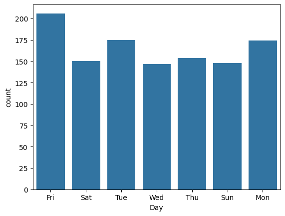
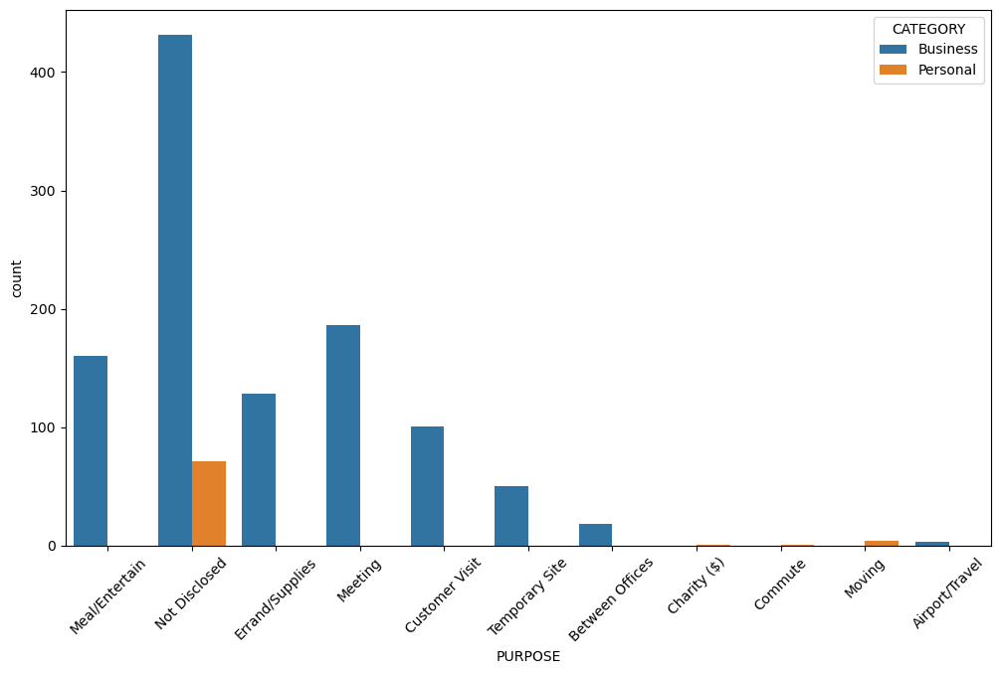
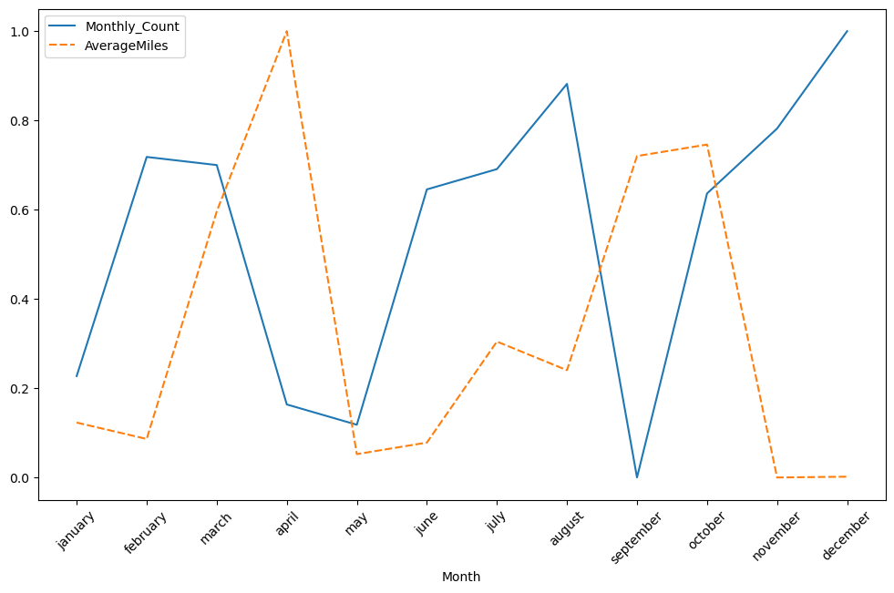

# Uber Ride Data Analysis 🚕

Exploratory data analysis of 1,156 Uber ride records to uncover patterns in when,
why, and how far people ride, including time-of-day trends, business vs personal
usage, and seasonal patterns in trip frequency and distance.

## 📌 Objective
Analyze historical Uber trip logs to answer:
- When during the day/week do most rides happen?
- How does ride purpose differ between Business and Personal trips?
- Is there a seasonal trend in trip frequency vs distance traveled?
- What's the typical trip distance?
- Are any trip attributes correlated with each other?

## 🛠️ Tools & Libraries
- Python
- Pandas — data cleaning, feature engineering
- NumPy
- Matplotlib / Seaborn — visualization
- Scikit-learn — `MinMaxScaler`, `OneHotEncoder`

## 🧹 Data Cleaning & Feature Engineering
- Filled missing `PURPOSE` values with `"Not Disclosed"` instead of dropping them, to preserve trip volume for other analyses
- Dropped the remaining rows with corrupted/missing core fields (date, category, start/stop)
- Removed duplicate records
- Parsed `START_DATE`/`END_DATE` into proper datetime objects
- Engineered new features: `Date`, `Time` (hour), `Time_of_Day` (morning/afternoon/evening/night bins), `Day` (weekday name), `Month`

## 📊 Key Findings

| Question | Finding |
|---|---|
| Busiest day | **Friday** has the highest ride volume, followed by Monday and Tuesday |
| Busiest time of day | Most rides happen **afternoon–evening** |
| Frequency vs distance by month | Trends track together most months; **May** is an outlier with a sharp drop in both frequency and distance |
| Purpose breakdown | Majority of trips are **Business** category; most common purposes are *undisclosed*, followed by *Meeting* and *Meal/Entertainment* |
| Typical trip distance | Most trips fall between **1–5 miles** |
| Correlation between features | No strong correlation found between trip purpose, category, distance, or time confirms these are largely independent factors |

## 📈 Sample Visuals
*(embed 2–3 exported PNGs here)*
### Rides by day of week

### Purpose by category

### Frequency and Average


## 🚀 How to Run
```bash
git clone https://github.com/jobinjosej253/uber-ride-analysis.git
cd uber-ride-analysis
pip install pandas numpy matplotlib seaborn scikit-learn
jupyter notebook uber_ride_analysis.ipynb
```

## 📂 Repo Structure
├── UberDataset.csv
├── uber_ride_analysis.ipynb
├── images/
│ └── rides_by_day.png
│ └── purpose_by_category.png
│ └── frequency_and_average.png
└── README.md

## 📄 License
MIT
